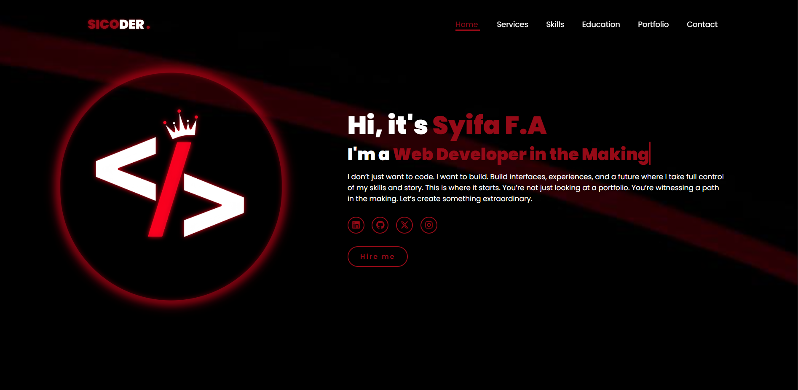

# 🚀 SICODER — Personal Portfolio

**SICODER** is a personal branding portfolio built with pure **HTML** and **CSS**, showcasing my journey as a self-taught front-end developer.

This is not just a website — it's a declaration of my commitment to build, learn, and grow in public. 👩‍💻

---

## 🎯 Features

- Responsive and modern layout
- Clean UI with dark aesthetic theme
- Animated text section (typing effect)
- Custom SVG & icon styling
- Mobile-friendly navigation
- Service, Skills, Portfolio, and Contact sections

---

## 🛠 Tech Stack

- HTML5 (Semantic Structure)
- CSS3 (Flexbox, Grid, Animations)
- FontAwesome Icons
- Google Fonts (Poppins)

---

## 📸 Preview

[🔗 Live Demo](https://syfaarizal.github.io/sicoder-portfolio/)

---

## 📚 What I Learned

- How to structure and design a multi-section website
- How to write clean, responsive CSS using Grid & Flexbox
- The importance of design consistency, spacing, and font scaling
- Creating a personal brand as a developer

---

## 📬 Connect with Me

- 💼 [LinkedIn](https://www.linkedin.com/in/syifa-fauziyah-arizal-28a46a2aa/)
- 💻 [GitHub](https://github.com/syfaarizal)
- 📸 [Instagram](https://instagram.com/syfaarizal)

---

> Made with ❤️ and <code></></code> by Syifa F.A.
>